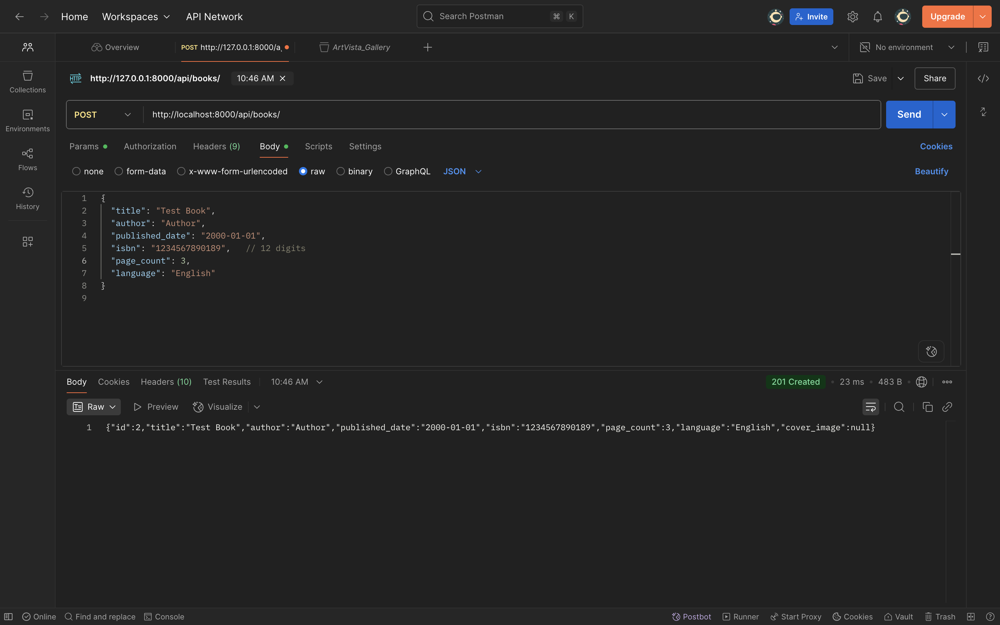
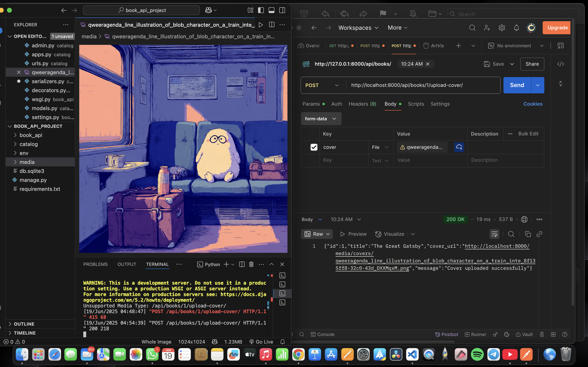
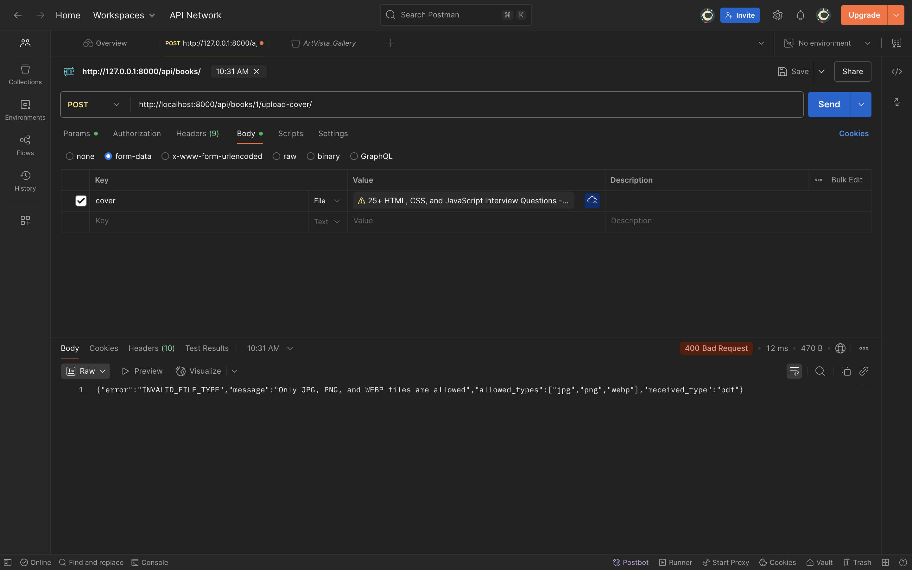
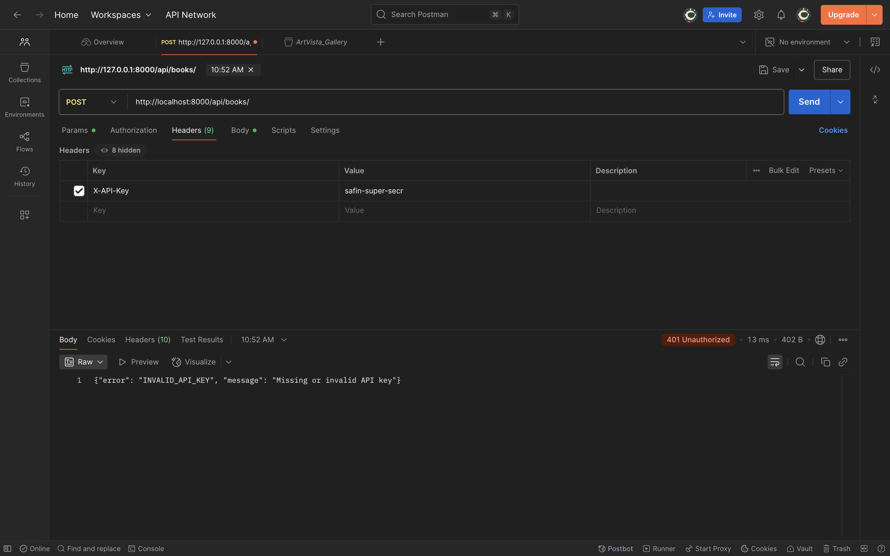
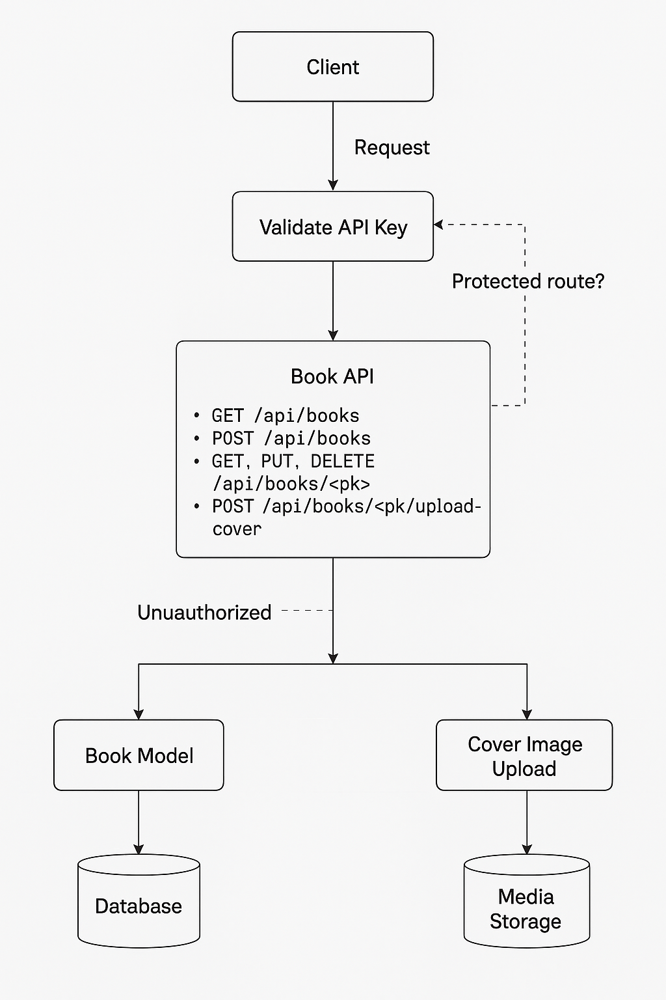

#  🌟 Book Catalog API

A RESTful Django API to manage a book catalog with authentication and file upload support.  
Includes API key–based access control and complete CRUD functionality for books.

---

## ⚡️ Features

- List all books (public)
- Create, update, and delete books (requires API Key)
- Upload book cover images with validation
- ISBN, date, and image validations included
- Postman test cases with sample responses

---

## 🛠️ Setup Instructions

### 1. Clone the repository
```bash
git clone https://github.com/YOUR_USERNAME/book-api-assignment.git
cd book-api-assignment
```

### 2. Create and activate virtual environment
```bash
python3 -m venv env
source env/bin/activate
```

### 3. Install dependencies
```bash
pip install -r requirements.txt
```

### 4. Apply migrations
```bash
python manage.py makemigrations
python manage.py migrate
```

### 5. Run the server
```bash
python manage.py runserver
```

---

## 🔐 API Key Configuration

In your `settings.py`, add:
```python
VALID_API_KEYS = ['your-secret-api-key']
```

To access protected endpoints, send this header:
```
X-API-Key: your-secret-api-key
```

---

## 📁 Sample .env Format

(Optional: only if using python-decouple or similar)
```env
DEBUG=True
SECRET_KEY=your-django-secret-key
```

---

## 📦 API Endpoints

| Method | Endpoint                        | Auth Required | Description             |
|--------|----------------------------------|---------------|-------------------------|
| GET    | `/api/books/`                   | ❌ No         | List all books          |
| POST   | `/api/books/`                   | ✅ Yes        | Create a new book       |
| GET    | `/api/books/<pk>/`              | ❌ No         | Get details of a book   |
| PUT    | `/api/books/<pk>/`              | ✅ Yes        | Update book info        |
| DELETE | `/api/books/<pk>/`              | ✅ Yes        | Delete a book           |
| POST   | `/api/books/<pk>/upload-cover/` | ✅ Yes        | Upload book cover image |

---

## 📤 File Upload Requirements

- **Endpoint**: `/api/books/<pk>/upload-cover/`
- **Method**: `POST`
- **Field**: `cover` (multipart/form-data)
- **Valid types**: `jpg`, `png`, `webp`
- **Max size**: `2MB`

---

## ✅ Validations

- ISBN: Must be exactly **13 characters**
- Page count: **≥ 1**
- Published date: **Cannot be in the future**
- Cover Image: Must be **JPG, PNG, or WEBP** and **≤ 2MB**

---

## 🧪 Postman Collection

Download the full test collection:  
📁 `screenshots`

---

## 🖼️ Screenshots of Postman Tests

| Test Case | Screenshot |
|-----------|------------|
| ✅ Create Book |  |
| ✅ Upload Cover |  |
| ❌ Invalid File Type |  |
| ❌ Unauthorized API Key |  |
| ❌ Upload > 2MB |  |

---

## 📃 Sample API Responses

### ✅ Successful Cover Upload
```json
{
  "id": 1,
  "title": "The Great Gatsby",
  "cover_url": "http://localhost:8000/media/covers/gatsby.jpg",
  "message": "Cover uploaded successfully"
}
```

### ❌ Invalid File Type
```json
{
  "error": "INVALID_FILE_TYPE",
  "message": "Only JPG, PNG, and WEBP files are allowed",
  "allowed_types": ["jpg", "png", "webp"],
  "received_type": "pdf"
}
```

### ❌ Authentication Failed
```json
{
  "error": "INVALID_API_KEY",
  "message": "Missing or invalid API key"
}
```
---

## ⚡️ Flow Chart
-   

---

## 🧑‍💻 Author

**Safin Koradiya**  
💻 Django Developer Intern Assignment  
📧 safinkoradiya30@gmail.com

---

## 🗂️ Submission Summary

- ✅ Django project with all required features
- ✅ requirements.txt file
- ✅ Postman test collection
- ✅ 5 screenshots of test results
- ✅ GitHub repository with clean structure and README
